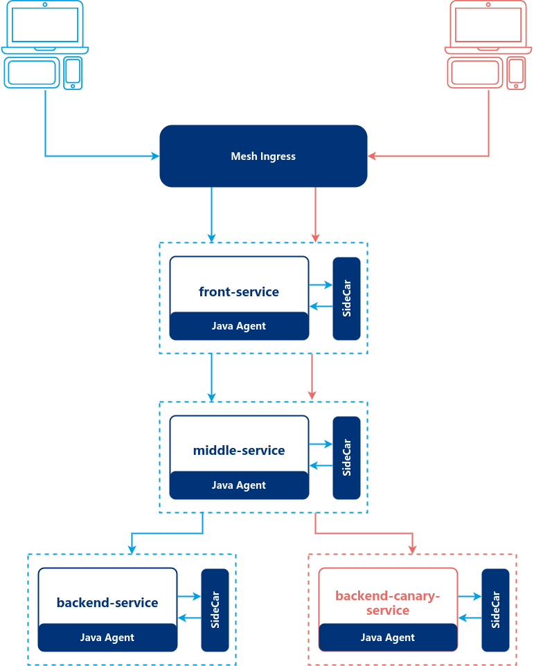

### Introduction

The codebase is dedicated to demonstrating how to use the EaseMesh to governance of services
All services in the repository are written in Java Language with the *pure* spring-boot framework. It's not required to introduce any service registry client library such as the Consul, Eureka, and Nacos.

The topology of services are illustrated as below:



We have three services which are *front-service*, *middle-service*, *backend-service*, each service has a expose a function via Restful API. All APIs have the same signature:

```
GET /greeting
```

When a request is sent to the *front-service*, the service will forward the request to the *middle-service*, the *middle-service* will forward to the *backend-service*, at last, the *backend-service* return a string with contents of `greeting from backend` to *middle-service*, *middle-service* appends `greeting from middle service, and ` to the response and return to *front-service*, *front-service* appends `greeting from the front, and ` to the response and returns to the client.

> The *front-service* leverages the `FeignClient` call the *middle-service*, the *middle-service* leverages the `RestTemplate` to call *backend-service*. URLs of the FeignClient and the RestTemplate are configured in `application.yml`, it will inject to FeignClient annotation via @Value annotation. 


#### Get Started

After the EaseMesh is install.